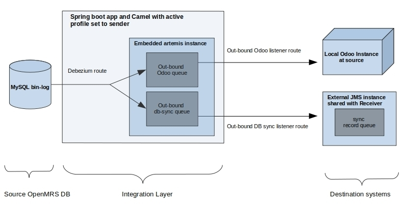
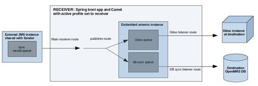

# Introduction
This project aims at providing a low-level OpenMRS synchronization module based on [Apache Camel](https://camel.apache.org/manual/latest/faq/what-is-camel.html).
Data is directly pulled from a source OpenMRS MySQL database and pushed to a target OpenMRS MySQL database without any use of the OpenMRS Java API or data model.

The project is composed of two modules:
- The Camel component module. The component knows two verbs: _extract_ and _load_. _Extract_ is used to retrieve data from the database and send it into Camel routes. _Load_ is used to receive the data from Camel routes to store it in the database.
- The app module, which is a Spring Boot application having either the role of the sender, the receiver or both that will launch the Camel routes.

The application uses [Lombok](https://projectlombok.org/) to allow creating POJOs without coding their getters and setters. A plugin needs to be installed to the IDE to add setters and getters at compile time.

# OpenMRS Data Model compatibility
The master branch should be compatible with the data model of the OpenMRS's version currently on the master branch of OpenMRS core
Each released minor version of OpenMRS will lead to a maintenance branch.
For example if you intend to synchronise data between an OpenMRS instance running on Core 2.4.x and another OpenMRS instance running on Core 2.3.x, you will use the appropriate build of the OpenMRS Camel component on each end.

# Sample Configuration for Testing
The application is designed to run in one of 2 modes i.e. sender or receiver, you decide one of these via spring's JVM 
property **spring.profiles.active** with the value set to sender or receiver. The 2 OpenMRS installations that we need 
to sync between each has its own local Odoo system to integrate with, Odoo is an ERP system. 

A sender and a receiver directory are created to simulate a network between a remote database and a central database. They are both located in the **sample/sample_springboot_setup** directory.
Please refer to the [Sample configuration README.md](./sample/sample_springboot_setup/README.md) for details about its configuration.

The OpenMRS dbSync can be used with any Camel endpoint between the sender and the receiver including ActiveMQ via `jms` queues. A sample configuration can be found in the **/sample/sample_activemq_setup** directory.
Please refer to the [Configure ActiveMQ README.md](./sample/sample_activemq_setup/README.md) for details about its configuration.

It's very important to note that technically this is DB to DB sync happening outside of the OpenMRS application, this has implications e.g if you sync something like patient, the search index needs to be triggered for a rebuild,
the current dbsync route internally triggers this rebuild for all known indexed entities.

### Sender

  

As seen from the diagram above, the sender is really a spring boot application at the core running with the active 
profile set to sender, it uses Apache camel to route messages to specific targets and uses [debezium](https://debezium.io) 
to track DB changes in source OpenMRS database by reading the mysql binary log which MUST be enabled with the format set 
to row, please referto inline documentation of the various configuration properties in the sender application.properties 
in the sample/sample_springboot_setup/sender folder.

Note that the default application that is bundled with the project comes with dockerized MySQL databases where the
MySQL binlog is preconfigured ONLY for remote instance because it assumes a one-way sink from remote to central.

When the application is fired up in sender mode, the debezium route starts the debezium component which will periodically 
read entries in the mysql binlog of the remote OpenMRS MySQL DB, it constructs a SyncRecord instance which has 3 fields,
the source table name, the uuid of the affected entity and the operation(c, u, d) for Create, Update or Delete respectively.
The debezium route calls the publisher route with the body set to the SyncRecord instance, the publisher route pushes the
sync record into an embedded active artemis(activeMQ) instance to all configured message queues, by default the application 
has 2 out-bound queues, one for the out-bound DB sync route and the other for the local Odoo system. In theory, you can 
register as many queues as the systems that need to be notified of changes in the OpenMRS DB, the sender's application.properties 
file has a property named **sync-record.destinations** which takes a comma separated list of queue names to which the 
sync record will be published, and you would have to add a consumer for each registered queue to feed another system. 
The out-bound DB sync listener route consumes message from its queue, loads the entity by its uuid, serialize it into a 
custom format and then publishes the payload into a sync record message queue in another external message broker that is 
known to the team administering OpenMRS instance's MySQL DB that we need to sync to. The out-bound Odoo listener route 
consumes message from its queue too, does its custom processing and then feeds the configured Odoo system.
    
### Receiver

   

As seen from the diagram above, the receiver is exactly the same spring boot application with Apache camel but instead 
running with the active profile set to receiver at another physical location with an OpenMRS installaton.

Recall from the sender documentation above, that the DB sync listener route ends by publishing the payload of the entity 
to be synced into a message broker known to the team administering the OpenMRS instance's DB we need to sync to, this 
where the receiver starts, its main receiver route connects to this message broker MOST likely over the internet and 
consumes messages out of sync record queue and pushes the payload into the embedded active artemis(activeMQ) instance to 
all configured message queues, by default the application has 2 in-bound queues, one for the in-bound DB sync route and 
the other for a local Odoo system. In theory, you can register as many queues as the systems that need to be notified of 
the in-bound entity payload, the sender's application.properties file has a property named **entity-payload.destinations** 
which takes a comma separated list of queue names to which the entity payload will be published, and you would have to 
add a consumer for each registered queue to feed another system. The in-bound DB sync listener route consumes message 
from its queue and syncs it into the destination OpenMRS instance's MySQL DB. The in-bound Odoo listener route consumes 
message from its queue too, does its custom processing and then feeds the configured Odoo system.

**NOTE:** In this default setup since it's a one-way sync, MySQL bin-log isn't turned on for the destination MySQL DB, 
if you need to do 2 way sync, you can turn it on for the destination DB too, but you must be wondering if syncing an 
entity won't get us into an infinite sync loop, this is taken care of by disabling mysql bin logging for the session on 
the connection objects used when running in receiver mode.

# File synchronization
It is also possible to synchronize the content of a directory. The directory sync is performed via a different Camel route, but files will be transferred through the same Camel endpoint as the entities.
To differentiate entities from files at reception, files are encoded in Base64 and the result is placed between the `<FILE>` and `</FILE>` tags.

# Build and Test
Unit ant Integration tests were only coded for the camel-openmrs Maven module.
Integration tests are located in the [**app/src/it**](./app/src/it) folder. They are run by default during the Maven test phase. 

# Architecture
The project has a classic architecture with a service layer and a DAO layer.
Each action (to get or save entities) of the Camel endpoints comes with the name of the table upon which the action is performed.
A facade (`EntityServiceFacade`) is used to select the correct service to get or save entities according to the table name passed as a parameter.

Once entities are retrieved from the database they are mapped to a model object. The model contains all non-structured fields of the OpenMRS object and follows a systematic rule for linked structured field: it only stores the _UUID_ of the linked entities.

For example let us consider the OpenMRS Camel entities `Observation`, `Encounter` and `Visit`.
The model corresponding to `Visit` is named `VisitModel` and will look like:
```java
class Visit {

  private String uuid;

}

class VisitModel {

  private String uuid;

}
```
The model corresponding to `Encounter` is named `EncounterModel` and will look like:
```java
class Encounter {

  private String uuid;

  @NotNull
  private Visit visit;

}

class EncounterModel {

  private String uuid;

  private String visitUuid;

}
```
Note that for the sake of this readme we assume that each encounter must be linked to a visit.
The model corresponding to `Observation` is named `ObservationModel` and will look like:
```java
public class Observation {

  private String uuid;

  @NotNull
  private Encounter encounter;

}

public class ObservationModel {

    private String uuid;

    private String encounterUuid;

}
```
The model object is then encapsulated in a wrapping `SyncModel` object that references the class of the object being synchronised, it is this wrapper that is in fact marshalled into a json string before being sent through the Camel routes.

Once the marshalled json string is received on the target side, its embedded model object is unmarshalled based on the object class referenced in the `SyncModel`. At this point the model object is reconstructed on the target side, still holding references to its linked entities as UUIDs. Such as for instance `encounterUuid` in the `ObservationModel` above.

Let us imagine the case of an `Observation` object being synchronised and arriving on the target end of the Camel route.

To reconstruct an `Observation` entity and its linked entities from an `ObservationModel` instance before saving it in the target database, the mapper will fetch and set each linked entity from the target database with their UUID.

* If the linked entity already exists in the target database it will be set as it is fetched from the target database.
* If the linked entity does not exist yet, it will create a so-called _lightweight_ entity (`LightEntity`) carrying only the UUID of the linked entity and all its non-nullable non-entity members filled with default values (so typically default dates and other strings ... etc.)

When a non-nullable member of the linked light entity is also an entity, a _placeholder_ voided (or retired) entity is set for this non-nullable member.
After some cycles of synchronisation, placeholder entities should no longer be attached to any entity. For example:

Let us consider the following situation when an `Observation` is synchronized before its `Encounter` and before the encounter's `Visit`.

A lightweight `Encounter` with the correct UUID is created and saved into the target database before being set to the `Observation`, and before saving that `Observation`.
<br/>However this `Encounter` requires a non-nullable `Visit` about which we do not have any information at all yet. For this one a lightweight **voided** _placeholder_ instance is used in order for the object tree `Observation` → `Encounter` → `Visit` to have all its non-nullable entities set before saving the `Observation`.
<br/>Each set of entities (`Visit`, `Ecnounter`, `Observation`, ... ) can have at most **one** such voided placeholder instance that is always reused to fill this exact same purpose: fill non-nullable members of other entities. This means for instance that each time a placeholder `Visit` is needed it is always the same voided `Visit` that is used to fill that gap.

When the linked `Encounter` is eventually unmarshalled on the target side through a subsequent round of synchronization, it will contain the actual UUID of the `Visit` for which the voided placeholder was used. At that point the `Encounter` is thus saved in the target database with a lightweight `Visit` carrying the correct UUID rather than the placeholder lightweight visit.

When all synchronisation rounds have successfully completed all placeholders entities should be "detached", meaning that no other entities should be linked to them anymore.

# Project Main Dependencies
* [Spring Boot](https://spring.io/projects/spring-boot)
* [Spring Data](https://spring.io/projects/spring-data)
* [Apache Camel](https://camel.apache.org/)
* [Lombok](https://projectlombok.org/)
* [Bouncy Castle](https://www.bouncycastle.org/fr/)
