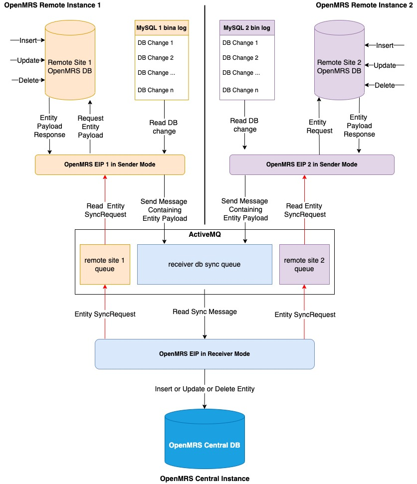
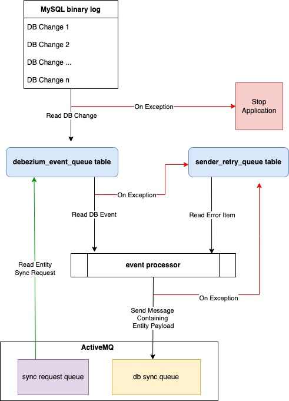
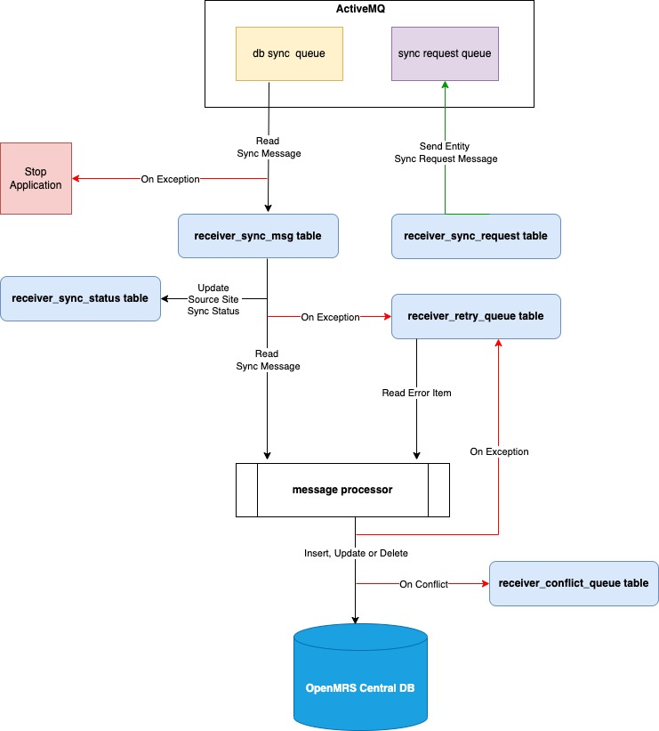

# Table of Contents

1. [Introduction](#introduction)
2. [Key Things To Note](#key-things-to-note)  
3. [OpenMRS Data Model Compatibility](#openmrs-data-model-compatibility)
4. [Installation Guide For DB Sync](distribution/docs/README.md)
5. [Architecture](#architecture)
    1. [Modules](#modules)
    2. [Design Overview](#design-overview)
    3. [Project Main Dependencies](#project-main-dependencies)
6. [Configuration](#configuration)
7. [Logging](#logging)
8. [Management Database](#management-database)
9. [Error Handling And Retry Mechanism](#error-handling-and-retry-mechanism)
10. [Conflict Resolution](#conflict-resolution)
11. [Sync Prioritization](#sync-prioritization)
12. [Sync Archive Pruning](#sync-archive-pruning)
13. [Requesting An Entity To Be Synced](#requesting-an-entity-to-be-synced)
14. [Developer Guide](#developer-guide)
    1. [Build](#build)
    2. [Tests](#tests)

# Introduction
This project aims at providing a low-level OpenMRS synchronization mechanism based on [Debezium](https://debezium.io) and
[Apache Camel](https://camel.apache.org/manual/latest/faq/what-is-camel.html).
Data is directly pulled from a source OpenMRS MySQL database and wired onto camel routes in an effort to integrate
OpenMRS with other systems without any use of the OpenMRS Java API or data model. The project comes with 2 built-in end
user sister applications to sync data from one OpeMRS MySQL DB to another.

# Key Things To Note
- Only specific database tables are watched i.e. only this set of tables get synced in case of DB sync. The list
of these tables is defined by this [TableToSyncEnum](camel-openmrs/src/main/java/org/openmrs/eip/component/service/TableToSyncEnum.java)
with the exception of the metadata tables with the assumption that metadata is already centrally managed using the
available metadata sharing tools. In future releases we want to make the list of tables to watch or sync configurable.

- The DB sync sender and receiver applications MUST be running on the same calendar system.    

# OpenMRS Data Model Compatibility
The application was initially built against the 2.3.x branch should be compatible with the data model of the OpenMRS core
2.3.0, in theory this implies there needs to a maintenance branch for every OpenMRS minor release that has any DB changes
between it and it's ancestor, master should be compatible with the latest released OpenMRS version.

# Architecture


Note that in the diagram above we have 2 remote OpenMRS instances but they can be multiple.

### Sender Architecture


### Receiver Architecture


### Modules
Below is the high level breakdown of what is contained in each module.
#### camel-openmrs
- JPA annotated OpenMRS data model classes and repositories.
- Services for loading and saving entities from and to the OpenMRS databases.
- Model classes used for serialization and deserialization purposes by DB sync sender and receiver.
- The OpenMRS DB datasource configuration.
- Utility custom camel components used to load and save entities to and from the target databases.
- Spring configurations and other utility classes

#### app
- End user application for sending and receiving DB sync data between 2 OpenMRS databases, the application can be run in 
  2 modes i.e. sender and receiver by activating different spring profiles.
- The built-in error handling and retry mechanism in case something goes wrong while processing an event.
- The liquibase changelog files used to create the management database tables.
- Management datasource configuration.
- Common spring configurations for end user apps.
- Base classes used for mapping to the management DB tables.

#### distribution

##### Sender
- All the camel routes used when the application in run in sender mode

##### Receiver
- All the camel routes used when the application in run in receiver mode

### Design Overview
The project has a classic architecture with a service layer and a DAO layer. Each action (to get or save entities) of the
Camel endpoints comes with the name of the table upon which the action is performed. A facade (`EntityServiceFacade`) is
used to select the correct service to get or save entities according to the table name passed as a parameter.

The project uses an embedded [debezium](https://debezium.io) engine to track insert, update and delete operations of
rows in monitored OpenMRS tables, out of the box the only monitored tables are those containing patient demographic and
clinical data, this implies that you need to configure MySQL binary logging in the source (sender) OpenMRS DB.

It's very important to note that technically when using this application for DB sync, this is DB to DB sync happening
outside of the OpenMRS application, this has implications e.g if you sync something like person name, the search index
needs to be triggered for a rebuild, the current receiver DB sync route internally triggers this rebuild for all known
indexed entities from OpenMRS core, however it might not be up to date with later OpenMRS versions in case more indexed
entities were added and of course module tables.

Once entities are retrieved from the database they are mapped to a model object. The model contains all non-structured
fields of the OpenMRS object and follows a systematic rule for linked structured field: it only stores the _UUID_ of the
linked entities.

For example let us consider the OpenMRS Camel entities `Observation`, `Encounter` and `Visit`.
The model corresponding to `Visit` is named `VisitModel` and will look like:
```java
class Visit {

  private String uuid;

}

class VisitModel {

  private String uuid;

}
```
The model corresponding to `Encounter` is named `EncounterModel` and will look like:
```java
class Encounter {

  private String uuid;

  @NotNull
  private Visit visit;

}

class EncounterModel {

  private String uuid;

  private String visitUuid;

}
```
Note that for the sake of this readme we assume that each encounter must be linked to a visit.
The model corresponding to `Observation` is named `ObservationModel` and will look like:
```java
public class Observation {

  private String uuid;

  @NotNull
  private Encounter encounter;

}

public class ObservationModel {

    private String uuid;

    private String encounterUuid;

}
```
The model object is then encapsulated in a wrapping `SyncModel` object that references the class of the object being synchronised, it is this wrapper that is in fact marshalled into a json string before being sent through the Camel routes.

Once the marshalled json string is received on the target side, its embedded model object is unmarshalled based on the object class referenced in the `SyncModel`. At this point the model object is reconstructed on the target side, still holding references to its linked entities as UUIDs. Such as for instance `encounterUuid` in the `ObservationModel` above.

Let us imagine the case of an `Observation` object being synchronised and arriving on the target end of the Camel route.

To reconstruct an `Observation` entity and its linked entities from an `ObservationModel` instance before saving it in the target database, the mapper will fetch and set each linked entity from the target database with their UUID.

* If the linked entity already exists in the target database it will be set as it is fetched from the target database.
* If the linked entity does not exist yet, it will create a so-called _lightweight_ entity (`LightEntity`) carrying only the UUID of the linked entity and all its non-nullable non-entity members filled with default values (so typically default dates and other strings ... etc.)

When a non-nullable member of the linked light entity is also an entity, a _placeholder_ voided (or retired) entity is set for this non-nullable member.
After some cycles of synchronisation, placeholder entities should no longer be attached to any entity. For example:

Let us consider the following situation when an `Observation` is synchronized before its `Encounter` and before the encounter's `Visit`.

A lightweight `Encounter` with the correct UUID is created and saved into the target database before being set to the `Observation`, and before saving that `Observation`.
<br/>However this `Encounter` requires a non-nullable `Visit` about which we do not have any information at all yet. For this one a lightweight **voided** _placeholder_ instance is used in order for the object tree `Observation` → `Encounter` → `Visit` to have all its non-nullable entities set before saving the `Observation`.
<br/>Each set of entities (`Visit`, `Ecnounter`, `Observation`, ... ) can have at most **one** such voided placeholder instance that is always reused to fill this exact same purpose: fill non-nullable members of other entities. This means for instance that each time a placeholder `Visit` is needed it is always the same voided `Visit` that is used to fill that gap.

When the linked `Encounter` is eventually unmarshalled on the target side through a subsequent round of synchronization, it will contain the actual UUID of the `Visit` for which the voided placeholder was used. At that point the `Encounter` is thus saved in the target database with a lightweight `Visit` carrying the correct UUID rather than the placeholder lightweight visit.

When all synchronisation rounds have successfully completed all placeholders entities should be "detached", meaning that no other entities should be linked to them anymore.

The application uses [Lombok](https://projectlombok.org/) to allow creating POJOs without coding their getters and setters. A plugin needs to be installed to the IDE to add setters and getters at compile time.

### Project Main Dependencies
* [Spring Boot](https://spring.io/projects/spring-boot)
* [Spring Data](https://spring.io/projects/spring-data)
* [Apache Camel](https://camel.apache.org/)
* [Debezium](https://debezium.io)
* [Lombok](https://projectlombok.org/)
* [Bouncy Castle](https://www.bouncycastle.org/fr/)

# Configuration
This project is built with spring boot therefore you can refer to spring boot's [application.properties](https://docs.spring.io/spring-boot/docs/current/reference/html/appendix-application-properties.html)
file to further configure the applications and documentation details of each property.

For the DB sync sender and receiver configuration, please refer to the [DB sync installation](distribution/docs/README.md) guide.

# Logging
The DB sync applications are spring boot applications and custom applications are also expected to be spring boot
applications. The end user applications come with built-in logback files on the classpath i.e. `logback-spring.xml` and
`logback-console.xml`, the `logback-spring.xml` file writes the logs to a file at `{eip.home}/.openmrs-eip/logs` where
`{eip.home}` is the app installation directory. The `logback-console.xml` writes logs to the console, this can be useful 
in a dev environment and tests.

For camel-routes, you need to set the logging level using their route ids, for instance if a route id is `my-route`,
then you set the logging level as below.
```
logging.level.my-route=DEBUG
```

For built-in routes and all classes in this project, you can globally set their log level by setting the value of the
`openmrs.eip.log.level` property in the application.properties file. For all other classes please refer to
[spring boot logging configurations](https://docs.spring.io/spring-boot/docs/current/reference/html/appendix-application-properties.html#common-application-properties-core)

# Management Database
Both DB sync applications (sender and receiver) come with an embedded management DB each where they store failed DB 
entity events for purposes of re-processing, the receiver app also stores the entities with conflicts in a table in this 
database

The management DB by default is an H2 database, it should be possible to use another DB system but we highly recommend
those that are embeddable since they can be bootstrapped with the application, the DB should also reside on the same
physical machine as the application to eliminate any possibility of being unreachable.

The management database(s) can be accessed from the browser at the http://localhost:{TOMCAT.PORT}/{H2.PATH} where 
`{TOMCAT.PORT}` and `{H2.PATH}` are the property values set in the associated properties files for `server.port` and 
`spring.h2.console.path` respectively. **Note** that the property `spring.h2.console.enabled` must be set to true to access 
the database console application.

# Error Handling And Retry Mechanism
Both DB sync applications (sender and receiver) have a built-in error handling and retry mechanism in
case something goes wrong during execution, the failed event gets pushed into respective error queues in the [management database](#management-database)
that comes as an embedded H2 database which can be accessed from a browser at a port and path configured in your
application.properties file. The sender error queue is actually a table named `sender_retry_queue`. In theory this queue should
be empty all the time, there is a retry route which periodically polls the error queue and attempts to reprocess the events. When
a failed event is finally successfully re-processed, it gets removed out of the error queue. If an entity has an event in
the error queue, all subsequent DB events for it are automatically pushed to the queue. It's highly recommended to
take a look at this queue regularly for failed events, at least once day and address the root cause for failed events so that
they can be re-processed. Otherwise, the retry route will indefinitely attempt to re-processs them. You can configure how often
the retry queue should run, please refer to the [configuration](#configuration) section.

The DB sync receiver application uses a table named `receiver_retry_queue` to store failed incoming DB sync messages, 
please refer to the [configuration](#configuration) section.

# Conflict Resolution
When an entity is modified in the OpenMRS receiver database, the next sync item for the same entity will cause a
conflict and the receiver will move the item to the conflict queue, human adjudication is required to resolve the
conflict. When resolving a conflict, the user is able to view side by side both the current state in the receiver
database and the new one from the remote site to be able to select the winning state or merge the states, below are the
possible conflict resolution decisions to select from.

**IGNORE_NEW**

The current state in the receiving database is preserved i.e. the entire state from the remote is effectively ignored 
and the item is archived immediately.

**SYNC_NEW**

The new state from the remote site is synced as is i.e. the database state is effectively overwritten just like a 
regular sync and the item is moved to synced item queue.

**MERGE**

A merged state is synced i.e. the user selects the specific entity properties that they wish to overwrite with the new 
values from the remote sites and preserve current databases values for other properties.

To resolve a conflict from the UI, do the following.
1. Navigate to the conflicts tab in the receiver and click on the row for the conflict you wish to resolve, you should 
   see a dialog containing a state diff where green indicates added properties, yellow indicates modified properties, 
   red indicates removed properties and others are unchanged.
2. Select the decision option, if you select the MERGE option, you should go ahead to select the properties to be synced 
   with the new values.
3. Click the submit button.


# Sync Prioritization
When the receiver DB sync server is overwhelmed with a high volume of items waiting in the sync queue, this can have
negative implications to the centralization ecosystem e.g. the MPI data will be lagging behind remote sites since the 
integration mechanism depends on patient details to be synced first to the central database to get picked up implying 
patient lookups in the MPI would be searching against data that is not yet updated or still missing records. Therefore, 
it is important to process items from the sync queue as soon as possible which is why we have the sync prioritization 
feature in the receiver that allows the sync queue processor task to get as much CPU time as possible when the count of 
items in the sync queue is high, as opposed to always sharing CPU time with other less important tasks like response 
sender, archiver etc.

Sync prioritization feature is enabled by default but can be disabled, when enabled the application uses some smart 
logic to determine an optimal threshold size of items in the sync queue beyond which the prioritization kicks in, the 
optimal threshold size is based on available sync threads and the average time it takes to process a single sync item 
which is hard coded at 4 seconds.

To disable or customize the sync prioritization feature, please refer to the **Sync Prioritization** section in the 
[receiver application.properties](https://github.com/FriendsInGlobalHealth/openmrs-eip/blob/master/distribution/docs/receiver/application.properties)

# Sync Archive Pruning
The DB sync receiver application maintains an archive of each and every sync item sent it receives it in a database 
table, you can guess that after a long period of time, this table can grow extremely large which would slow down the 
queries against it when loading the receiver dashboard and DDL operations for the table would be very slow during 
upgrades. Therefore, a pruner task was added to periodically delete all archives older than a configured age.

The pruning task is disabled by default but can be enabled and customized, please refer to the **Sync Archives Pruning** 
section in the [receiver application.properties](https://github.com/FriendsInGlobalHealth/openmrs-eip/blob/master/distribution/docs/receiver/application.properties)


# Requesting An Entity To Be Synced
The application has a mechanism that allows the receiver to request for an entity to be synced from a specific remote 
site to central, this is done by inserting a row in the `receiver_sync_request` table with the following columns that 
you need to set,

**table_name:** The name of the database table containing the entity  
**identifier:** The unique identifier of the entity typically the entity uuid  
**site_id:** Foreign key value for the database id of the source remote site i.e. the id value of the site in the `site_info` table  
**date_created:** The insertion datetime  
**request_uuid:** The unique UUID of the sync request (Used to track the request when in the remote site once sent)

A sync request has a status field which defaults to `NEW` on insertion, every 30 minutes the receiver polls the 
`receiver_sync_request` table for rows with the `NEW` status and submits them to their respective target remote site
queues in the artemis instance, there will be a queue name for each remote site where the name is of the format
`activemq:openmrs.sync.request.{SITE_IDENTIFIER}` where `{SITE_IDENTIFIER}` is the value of the identifier column of the 
site row in the site_info table.

# Developer Guide
## Build
From the terminal, navigate to your working directory, clone and build the project to generate the executable artifacts
by running the commands below.
```shell
git clone https://github.com/openmrs/openmrs-eip.git
cd openmrs-eip
git checkout 1.x
mvn clean install
```
Make sure the build completed successfully.

## Tests
Unit ant Integration tests were only coded for the camel-openmrs Maven module. Integration tests are located in the
[**app/src/it**](app/src/it) folder. They are run by default during the Maven test phase
